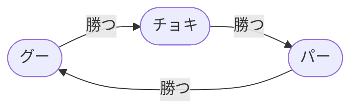
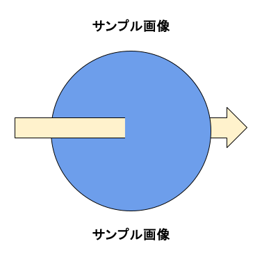

<!--- _class: title --->

<br>

> # タイトル
>
> ### サブタイトル

<br>
<br>

20XX年 MM月 DD日
**発表者**


---
<!---
footer: "**発表者** | **タイトル** サブタイトル"
class: main
--->

## Agenda

1. 見出しサンプル
1. 箇条書きリストサンプル
1. 番号付きリストサンプル
1. 引用・ハイパーリンクサンプル
1. テーブルサンプル
1. コード挿入サンプル
1. 数式挿入サンプル
1. 文字装飾サンプル
1. Mermaidサンプル
1. 画像の挿入サンプル

---

# 見出しサンプル

# H1 ABCDE abcde あいうえお 東京特許許可局

## H2 ABCDE abcde あいうえお 東京特許許可局

### H3 ABCDE abcde あいうえお 東京特許許可局

#### H4 ABCDE abcde あいうえお 東京特許許可局

##### H5 ABCDE abcde あいうえお 東京特許許可局

###### H6 ABCDE abcde あいうえお 東京特許許可局

---

# 箇条書きリストサンプル

* お前それで良いのか？
* 何いきなり話かけて来てるわけ？
    * お前ﾊｲｽﾗでﾎﾞｺるわ・・
        * ｶﾞｰﾄﾞ固めてたからｷｬﾝｾﾙしてｶｶッっとﾀﾞｯｼｭしながらﾊｲｽﾗ
        * ついげきのグランドヴァイパでさらにﾀﾞﾒｰｼﾞは加速した
    * 俺はこのままﾀｲﾑｱｯﾌﾟでもいいんだが？
* うるさい、気が散る。一瞬の油断が命取り
* 時既に時間切れ

---

# 番号付きリストサンプル

1. はやくきて～はやくきて～
1. もうついたのか！
    1. はやい！
        1. きた！盾きた！
        1. メイン盾きた！
    1. これで勝つる！
1. 勝ったと思うなよ・・・
1. もう勝負ついてるから
1. キングベヒんもスは倒された

---

# 引用・ハイパーリンクサンプル

> ブロント語とは、2ちゃんねるのネトゲ実況板等に現れた名無し、通称『ブロント（ブロントさん）』が使用したと言われている、独特の文章構成で会話するネットスラングの一種である。 好んでブロント語を使う者は『ブロンティスト』と呼ばれる。

引用元 : [ブロント語とは (ブロントゴとは) [単語記事] - ニコニコ大百科](https://dic.nicovideo.jp/a/%E3%83%96%E3%83%AD%E3%83%B3%E3%83%88%E8%AA%9E)

---

# テーブルサンプル

| 見出し1 | 見出し2 | 見出し3 | 見出し4 |
|------|:-----|:----:|-----:|
| 指定なし | 左寄せ<br>(:----) | 中央寄せ<br>(:---:) | 右寄せ<br>(----:) |
| 1       | 2     | 3       | 4      |
| 10      | 20    | 30      | 40     |
| 100     | 200   | 300     | 400    |

---

# コード挿入サンプル (1/3)

* Python
```python
import pandas as pd

# CSVファイルを読み込む
df = pd.read_csv("data.csv")

# 先頭5行を表示
print(df.head())
```

* JavaScript
```javascript
console.log("Hello, World");
```

---

# コード挿入サンプル (2/3)

* C
```c
#include <stdio.h>
int main() {
    printf("Hello, World\n");
    return 0;
}
```

* C++
```cpp
#include <iostream>
int main() {
    std::cout << "Hello, World" << std::endl;
    return 0;
}
```

---

# コード挿入サンプル (3/3)

本文中にコードを混ぜて書きたい場合は、 `` ` `` で囲うインラインコードを使う

`df.head()` は、DataFrame (`df`) の先頭 5 行を表示するためのメソッドです。

デフォルト(指定なしの場合)では5行だが、`df.head(10)` のように引数で指定すれば任意の行数を表示することが可能 (`df.head(10)` の場合は10行表示される)

---

# 数式挿入サンプル

* ブロック数式
$$
\int^2_0 (x+1)dx=\left[\frac{1}{2}x^2+x\right]^2_0=4
$$ 
* インライン数式
    * オイラーの公式は $e^{i\pi} + 1 = 0$ で表されます。

---

# 文字装飾サンプル (1/2)

* 太字にするには `*`２つ or `_`２つ で囲う : **\*\*太字\*\*** __\_\_太字\_\___
* 斜体にするには `*`２つ or `_`２つ で囲う : *\*斜体\** _\_斜体\__
* 太字斜体にするには `*`3つ or `_`3つ で囲う : ***\*\*\*太字斜体\*\*\**** ___\_\_\_太字\_\_\____
* 訂正線をつけるには `~~`で囲う : ~~\~\~訂正線\~\~~~
* 下線をつけるには \<u\> 〜 \</u\> で囲う : <u>\<u\>下線\</u\></u>

前後に半角スペースまたは改行で区切りを入れる

`*`,`_`や`~`を太字/斜体にする場合、バックスラッシュ`\`でエスケープ

---

# 文字装飾サンプル (2/2)

<center>中央寄せ</center>

<div style="text-align:center">中央寄せ</div>

<div style="text-align:right">右寄せ</div>

<div style="text-align:left">左寄せ</div>

<span style="font-size: 40px;">文字のサイズ 40px</span> <span style="font-size: 15px;">文字のサイズ 15px</span>

<span style="font-size: 40px;">文字のサイズ 40px</span> <span style="font-size: 15px;">文字のサイズ 15px</span>

<span style="color: rgb(233, 71, 9);">テキスト色変更</span>

---

# Mermaidサンプル



<div class="mermaid">
graph LR
  node_1(["グー"])
  node_2(["チョキ"])
  node_3(["パー"])
  node_1 -->|勝つ| node_2
  node_2 -->|勝つ| node_3
  node_3 -->|勝つ| node_1
</div>

---

# 画像の挿入サンプル




---
<!---
class: last_page
--->

<center>
<b>
ご清聴ありがとうございました
</b>
</center>


